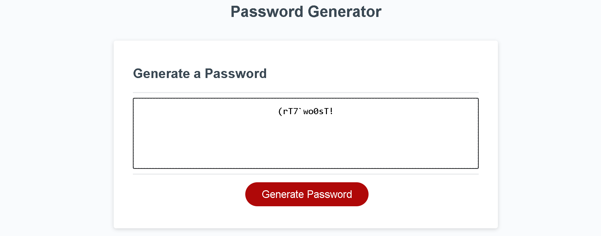

# password-generator
application: https://jmerges.github.io/password-generator/  
 
James Merges  
email: jamesmerges1@gmail.com  
github: https://github.com/jmerges  
linkedin: https://www.linkedin.com/in/james-merges-b938401b7/  
 
## Description
This application creates a random password based on some user input.
 The user is asked to choose a password length between 8 and 128 characters, 
 then select from 4 sets of characters to be used in generating the password.
 The base html and css files were provided by UCB Bootcamp -- my task was asked to
 edit the javascript so the application functions correctly.  
 
## Tools Used
An html and CSS page structure were provided by UCB Bootcamp. I used javascript to code the
 page alerts and the password generator function.  
 
## Preview
